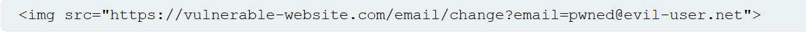

# How to deliver a CSRF exploit

Các cách thực hiện cho các cuộc tấn công *Cross-site request forgery* trên website về cơ bản giống với *reflected XSS*. Thông thường, kẻ tấn công sẽ đặt HTML độc hại lên một website mà họ điều khiển, và sau đó khiến nạn nhân truy cập trang web đó. Điều này có thể được thực hiện bằng cách cung cấp cho người dùng một liên kết đến trang web, thông qua email hoặc tin nhắn phương tiện truyền thông xã hội. Hoặc nếu cuộc tấn công được đặt vào một trang web phổ biến (ví dụ, trong một comment của người dùng), họ có thể chỉ chờ người dùng truy cập trang web.

Lưu ý rằng một số khai thác CSRF đơn giản sử dụng GET method và có thể được khép kín hoàn toàn với một URL duy nhất trên website dễ bị tổn thương. Trong tình huống này, kẻ tấn công có thể không cần sử dụng một trang web bên ngoài và có thể trực tiếp cung cấp cho nạn nhân một URL độc hại trên domain dễ bị tổn thương. Trong ví dụ trước, nếu request thay đổi địa chỉ email có thể được thực hiện với GET method, thì một cuộc tấn công khép kín sẽ trông như thế này:

